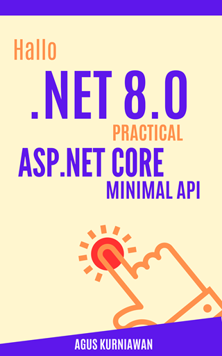

# Hallo .NET 8.0: Practical ASP.NET Core Minimal API

**Hallo .NET 8.0: Practical ASP.NET Core Minimal API** is a meticulously crafted guide that takes you on an explorative journey into the world of ASP.NET Core 8.0. Designed for a broad audience, from beginners to seasoned developers, this book dives deep into the practical aspects of Minimal API development. It starts with an introductory section that sets the foundation, highlighting the evolution and significance of Minimal APIs in the .NET framework. 

The core of the book is structured into comprehensive sections covering ASP.NET Core Minimal API development, database integrations, and critical aspects of web security. It stands out with its 20 hands-on lab exercises, each carefully designed to reinforce learning through practical application. From setting up development environments and building your first API to delving into complex topics like data security and efficient database handling, the book ensures a thorough understanding of each concept. 

In its final chapters, the book transitions into crucial topics like monitoring and deployment, preparing readers to not only build but also sustain and optimize applications in real-world settings. This section is pivotal for understanding the lifecycle of web applications and equips readers with the skills to deploy and maintain their projects effectively.

**Hallo .NET 8.0: Practical ASP.NET Core Minimal API** is more than a technical manual; it's an essential tool for mastering the ASP.NET Core 8.0 framework. Whether you're developing your first web application or looking to upgrade existing skills, this book is an invaluable asset. Its practical approach, combined with in-depth coverage of essential topics, makes it a must-have for anyone aspiring to excel in the rapidly evolving field of web development. Embark on this learning adventure and arm yourself with the knowledge and skills to confidently navigate the world of ASP.NET Core 8.0.

## How to Buy

You can buy this book the following online stores:

* Google Play Books: https://play.google.com/store/books/details?id=MZvpEAAAQBAJ
* Lulu: https://www.lulu.com/shop/agus-kurniawan/hallo-net-80-practical-aspnet-core-minimal-api/ebook/product-jeedyvz.html